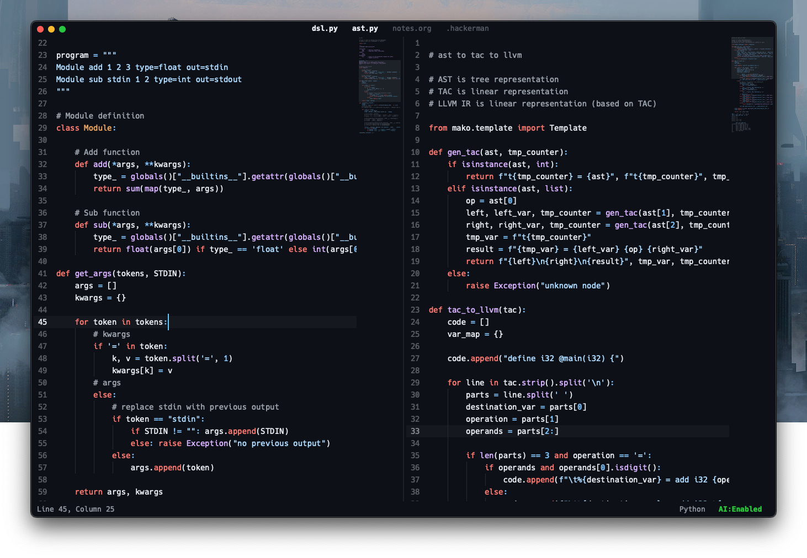

[Download](https://github.com/HackermanAI/text/releases) | [Buy license](https://hackerman.ai/#waitlist) | [Feedback + bugs](https://github.com/HackermanAI/text/issues) | [Submit feature request >>](https://github.com/HackermanAI/text/discussions/categories/ideas)




# Hackerman Text, the AI-native code editor

**Local-first AI. Zero-latency typing. No telemetry, no sign in.**


## Quick start guide

Useful default key bindings to get you started:

- `Command + E` to open file explorer (drop folder on editor or edit config file to update root directory)

- `Command + Shift + E` to open document outline for quick overview and navigation

- `Command + P` (or right click) to open function explorer with all editor functions and key bindings

- `Command + Shift + P` to open config file

- `Command + F` to open find in file

- `Command + Shift + F` to open project-wide search (hit enter in search box to export as org-file)

- `Command + W` to open split view (shared document with current open file)

- `Shift + Click` on file names in title to open many (stacked horizontally)


## Features

### Simple and fast

Built-in, native-level lexers. A minimal always-visible UI keeps the focus on code. The goal is near-zero typing latency, even in huge files, in any language. Anything that measurably slows this down is either removed or made opt-in.

### Inline AI chat

Edit and organize chat conversations as plain text, or Markdown. Chats can be saved to disk, version controlled, and opened later in any editor. Local model support via Ollama, plus out-of-the-box integration with OpenAI and Mistral, with more providers planned over time.

### Intuitive key bindings

Platform-default shortcuts. No learning curve. Everything is a function and bindable.

```
delete                  Backspace
...
line_up                 Up, Control + P
line_down               Down, Control + N
...
line_start              Command + Left, Control + A
line_end                Command + Right, Control + E
```

### Custom bindable functions

Write your own editor commands in a small, well-defined subset of Python. Functions hot-reload from your scripts file, show up in the function explorer, and can be bound to any key, so your custom workflows feel like built-in features.

### Context-aware autocomplete

Autocomplete stays fast by indexing the current file on load and updating as you type. Suggestions come only from your document and are ranked so the most likely match appears first.

### Project-wide search

Filter the file explorer instantly to jump to what you need (e.g. `c/`, `.py`). For deeper searches, scan every file for a pattern and export the results as plain text to save, share, or work from.


## Editor roadmap

| Done | Almost ready | TODO |
| :--- | :---         | :--- |
| Core editor features (multi-cursor, multiple selections)  | Bring your own lexer                                  | Remote development (SSH) |
| Everything as text files                                  | Support for mix-and-match LLMs (local and hosted)     | Virtual buffers for very large files (10M+ lines) |
| Multiple views, single document                           | Inline shell, eval, and AI chat                       | Sublime-like performance (on very large files) |
| Create your own themes                                    | Sublime-like performance                              |  |
| Local LLMs                                                |  |  |
| Copilot-like code completion                              |  |  |
| Project-wide search                                       |  |  |
| Keybind custom functions                                  |  |  |
| Emacs-like org mode for notes                             |  |  |
| Zero-latency typing (<10ms)                               |  |  |
| Context-aware autocomplete                                |  |  |
| Code scroller (minimap)                                   |  |  |

[Submit feature request >>](https://github.com/HackermanAI/text/discussions/categories/ideas)


## Programming language support

Minimal language support by design. The built-in lexers are hand-tuned for speed and precise syntax highlighting, with language-specific code folding.

| Supported     | Planned       |
| :---          | :---          |
| Assembly      | Dart          |
| Bash          | Fortran       |
| C             | Go            |
| C++           | Kotlin        |
| C#            | Lisp          |
| CSS           | Mojo          |
| D             | Nim           |
| Haskell       | OCaml         |
| HTML          | Perl          |
| JavaScript    | PowerShell    |
| LaTeX         | Prolog        |
| Lua           | R             |
| Makefile      | Scala         |
| Markdown      | Swift         |
| Odin          | TypeScript    |
| Pascal        | Verilog       |
| PHP           | Jai           |
| Python        |               |
| Ruby          |               |
| Rust          |               |
| Zig           |               |

[Submit feature request >>](https://github.com/HackermanAI/text/discussions/categories/ideas)

